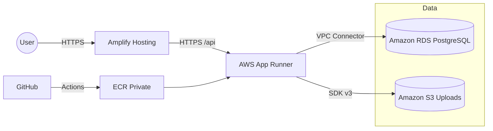

## Objetivo
Migrar ReSolVelo a AWS con arquitectura reproducible: frontend en AWS Amplify, backend en AWS App Runner, base de datos en Amazon RDS (PostgreSQL), almacenamiento de archivos en Amazon S3, CI/CD con GitHub Actions, seguridad por IAM mínimo necesario y monitorización básica.

## Auditoría Rápida del Repo
- Backend NestJS con Prisma y health (`/api/health`) listo: `src/app.module.ts:15-26`, `src/health/health.controller.ts:6-14`, `src/main.ts:68-71`.
- Cliente Prisma y arranque tolerante a DB: `src/prisma/prisma.service.ts:12-20`.
- Dockerfile multi-stage con migraciones en `CMD`: `Dockerfile:83-85`.
- Compose local: `docker-compose.yml` para dev (PostgreSQL, Redis, backend).
- Frontend Vue + Vite; API base por `VITE_API_BASE_URL` o proxy `/api`: `frontend/src/services/api.ts:12`.
- Prisma schema operativo: `context/schema.prisma`.

## Infraestructura AWS (RDS + VPC + SG + Secrets)
1. VPC
- Crear una `VPC` /16 con 2 subnets privadas en 2 AZ (`10.0.1.0/24`, `10.0.2.0/24`) y 1 subnet pública opcional.
- Habilitar `DNS hostnames` y `DNS resolution`.

2. RDS (PostgreSQL 15)
- Instancia `db.t3.micro` (dev), almacenamiento `gp3 20GB`, `Multi-AZ` desactivado (dev), `Public accessibility` desactivado.
- `DB Parameter Group`: ajustar `max_connections=100`, `timezone=UTC`, `log_min_duration_statement=2000ms`.
- `Subnet Group`: asociar subnets privadas.
- `Security Group (rds-sg)`: permitir `TCP 5432` desde el `Security Group` del `App Runner VPC Connector`.
- Backups: `Backup retention=7 días`, ventana de mantenimiento semanal, `Copy tags to snapshots` habilitado.

3. Secrets y credenciales
- Crear secretos en `AWS Secrets Manager` o parámetros en `SSM Parameter Store`:
  - `/resolvelo/dev/DATABASE_URL` (URL Prisma a RDS)
  - `/resolvelo/dev/JWT_SECRET`, `/BCRYPT_ROUNDS`, `/CORS_ORIGIN`
- Permitir lectura solo al `Role` del servicio App Runner.

## Backend (Docker + App Runner)
1. Imagen
- Usar el `Dockerfile` existente (multi-stage). Exponer `PORT=3000` en servicio App Runner para alinear con `docker-compose.yml`.

2. Despliegue en AWS App Runner
- Crear `ECR repo` privado `resolvelo-backend`.
- Pipeline: GitHub Actions construye imagen, etiqueta `latest` y `sha`, empuja a ECR y actualiza App Runner.
- Servicio App Runner:
  - Source: ECR privado
  - `Port=3000` (aplicación escucha vía `PORT`) y `Health check path=/api/health`.
  - `AutoScaling`: `minSize=1`, `maxSize=3`, `maxConcurrency=50`.
  - VPC Connector: asociar a subnets privadas; `Security Group` del conector con salida a RDS.
  - Variables de entorno: `NODE_ENV=production`, `PORT=3000`, `DATABASE_URL` (desde Secrets/SSM), `JWT_SECRET`, `CORS_ORIGIN` (dominio Amplify), `AWS_REGION`, `S3_BUCKET_NAME`.

3. Variables y configuración
- Mantener `Prisma migrate deploy` en `CMD` (ya presente). Healthcheck via `/api/health` operativo.
- Logs a CloudWatch (App Runner lo habilita automáticamente).

## Frontend (Amplify Hosting)
1. Build config
- Añadir `frontend/amplify.yml`:
  - `preBuild: npm ci`
  - `build: npm run build`
  - `artifacts: dist`
  - `cache: node_modules/**//*`
  - `redirects`: SPA rewrite 200 a `/index.html`.
  - `customHeaders`: seguridad y caché
    - `**/*.js|css|png|jpg|svg`: `Cache-Control: public,max-age=31536000,immutable`
    - `/index.html`: `Cache-Control: no-cache`
    - `Content-Security-Policy`, `X-Frame-Options`, `X-Content-Type-Options`, `Referrer-Policy`.

2. Variables de entorno Amplify
- Definir `VITE_API_BASE_URL=https://<app-runner-domain>/api`.

3. CI/CD
- Conectar repo GitHub a Amplify; build por rama `main`/`develop`. Amplify usa `amplify.yml` y variables.

## Almacenamiento de Archivos (S3)
- Crear `S3 bucket` `resolvelo-uploads-dev` con `Block Public Access` y entrega por presigned URLs.
- Política de IAM mínima para el `Role` del backend: `s3:PutObject`, `s3:GetObject`, `s3:DeleteObject` en el bucket.
- En backend, usar SDK v3 (`@aws-sdk/client-s3`) para operaciones; mantener compatibilidad temporal con `/uploads` local.

## Seguridad (IAM Mínimo + OWASP)
- IAM Roles:
  - `AppRunnerServiceRole`: `secretsmanager:GetSecretValue` o `ssm:GetParameters`, `logs:CreateLogStream/PutLogEvents`, `ec2:CreateNetworkInterface` limitado al VPC.
  - `AmplifyServiceRole`: lectura del repo, acceso a CloudWatch logs.
- TLS: App Runner y Amplify sirven HTTPS; configurar dominios y certificados en Amplify si aplica.
- Headers de seguridad en Amplify y `helmet` en backend si no estuviera habilitado.
- Auditoría: CloudTrail habilitado por defecto; revisar eventos de IAM y App Runner.

## Monitorización y Alarmas
- RDS: `CPUUtilization`, `DatabaseConnections`, `FreeStorageSpace` con alarmas (p.ej., CPU > 70% 5m, conexiones > 80% del límite, storage < 2GB).
- App Runner: `HTTPCodeELB5XXCount`, `ServiceCPUUtilization`, `ServiceMemoryUtilization`.
- Amplify: revisar logs de build y errores de distribución.

## CI/CD (GitHub Actions)
- Backend: workflow `backend-app-runner.yml`:
  - `aws-actions/configure-aws-credentials` (OIDC)
  - Login a ECR, build y push imagen, `aws apprunner update-service`.
  - Secrets requeridos en GitHub: `AWS_ACCOUNT_ID`, `AWS_REGION`, `ECR_REPOSITORY`, `APP_RUNNER_SERVICE_ARN`.
- Frontend: Amplify conectado a GitHub; usar `amplify.yml` para fases de build, headers y rewrites.

## Validación y Pruebas
- Smoke tests backend: hit `GET /api/health`, `GET /api/__routes` (`src/main.ts:72-85`).
- Prisma: `prisma migrate deploy` se ejecuta al iniciar; verificar conexión en logs (`src/prisma/prisma.service.ts:15-20`).
- Frontend: validar SPA routing y API base mediante `VITE_API_BASE_URL`.
- Checklist final:
  - App Runner accesible y respondiendo `/api/health`
  - Amplify desplegado con rewrites 200
  - RDS en subnets privadas, sin acceso público
  - App Runner con VPC Connector y lectura del secreto `DATABASE_URL`
  - S3 sin acceso público directo, subida vía presigned URL

## Documentación a Entregar (se crearán al aprobar)
- `ResolveloAWS.md` con:
  - Cambios de arquitectura y diagrama (Mermaid) del flujo Amplify → App Runner → RDS/S3.
  - Configuraciones concretas de AWS (instancia, parámetros, SG, VPC Connector, autoscaling, headers, rewrites).
  - Consideraciones técnicas importantes y decisiones.
- `docs/AWS-Guia-Paso-a-Paso.md`:
  - Pasos con capturas de consola AWS (RDS, VPC, App Runner, Amplify, S3).
  - Validaciones, checklist y troubleshooting.

## Diagrama (Mermaid)

## Cambios de Código/Archivos propuestos
- Añadir `frontend/amplify.yml` con build, headers de seguridad y cache, rewrites SPA.
- Añadir `.github/workflows/backend-app-runner.yml` para build/push ECR y update de App Runner.
- Añadir `docs/ResolveloAWS.md` y `docs/AWS-Guia-Paso-a-Paso.md` (explicaciones en español, nombres de servicios en inglés).
- Opcional: módulo de `S3Service` en backend para subir/leer/borrar usando presigned URLs.

¿Aprobamos este plan para ejecutar los cambios y entregar la documentación y pipelines?