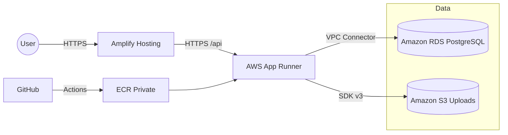

# Migración de ReSolVelo a AWS

Este documento detalla los cambios de arquitectura, configuraciones específicas de AWS, consideraciones técnicas y el diagrama de la nueva arquitectura para que la implementación sea reproducible.

## Cambios de Arquitectura
- Frontend hospedado en **AWS Amplify Hosting**.
- Backend desplegado en **AWS App Runner** desde contenedor en **Amazon ECR**.
- Base de datos en **Amazon RDS (PostgreSQL 15)** dentro de subnets privadas.
- Archivos de usuario en **Amazon S3** mediante URLs prefirmadas.
- Conexión backend→RDS vía **App Runner VPC Connector** y **Security Groups**.
- Secretos gestionados con **AWS Secrets Manager** o **SSM Parameter Store**.

## Diagrama

## Configuraciones Específicas de AWS

### VPC
- `VPC` /16 con subnets privadas (dos AZ).
- `DNS hostnames` y `DNS resolution` habilitados.

### RDS (PostgreSQL 15)
- Instancia `db.t3.micro` (dev), almacenamiento `gp3 20GB`.
- `Public accessibility`: desactivado.
- `DB Subnet Group`: subnets privadas.
- `Security Group (rds-sg)`: inbound `TCP 5432` desde SG del VPC Connector.
- Backups: `retention 7 días`; ventana de mantenimiento semanal.
- Parameter Group: `max_connections=100`, `timezone=UTC`, `log_min_duration_statement=2000ms`.

### App Runner
- Source: **ECR private**.
- `Port: 3000`; `Health check path: /api/health`.
- AutoScaling: `minSize=1`, `maxSize=3`, `maxConcurrency=50`.
- VPC Connector: subnets privadas; SG con salida a RDS.
- Runtime env:
  - `NODE_ENV=production`, `PORT=3000`.
  - `RuntimeEnvironmentSecrets`: `DATABASE_URL`, `JWT_SECRET` (ARNs de Secrets Manager).

### Amplify Hosting
- `amplify.yml` con `preBuild: npm ci`, `build: npm run build`, `artifacts: dist`.
- Rewrites SPA: 200 a `/index.html`.
- Headers de seguridad y caché:
  - Assets: `Cache-Control: public,max-age=31536000,immutable`.
  - `index.html`: `no-cache`.
  - `Content-Security-Policy`, `X-Frame-Options`, `X-Content-Type-Options`, `Referrer-Policy`, `Strict-Transport-Security`.
- Variables: `VITE_API_BASE_URL=https://<app-runner-domain>/api`.

### S3 (uploads)
- Bucket: `resolvelo-uploads-dev` con `Block Public Access`.
- IAM para backend: `s3:PutObject`, `s3:GetObject`, `s3:DeleteObject` en el bucket.
- Uso con SDK v3 y URLs prefirmadas.

### Secrets
- `Secrets Manager` o `SSM`:
  - `/resolvelo/dev/DATABASE_URL`
  - `/resolvelo/dev/JWT_SECRET`
  - `/resolvelo/dev/CORS_ORIGIN`
- Permitir lectura solo al `AppRunnerServiceRole`.

## Consideraciones Técnicas Importantes
- Alinear `PORT` del backend con `3000`; health en `/api/health`.
- `Prisma migrate deploy` corre al inicio del contenedor (Dockerfile).
- RDS en subnets privadas sin acceso público.
- App Runner con VPC Connector para salida privada a RDS.
- Amplify sirve HTTPS y aplica headers definidos en `amplify.yml`.
- Mantener `DATABASE_URL` y `JWT_SECRET` como secretos; nunca en repositorio.

## Referencias a Código
- Health: `src/health/health.controller.ts:11-14`.
- Prefijo API: `src/main.ts:68-71`.
- Dockerfile (migraciones): `Dockerfile:83-85`.
- API base en frontend: `frontend/src/services/api.ts:12`.